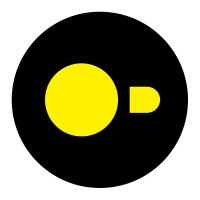

## Hi there 👋 I'm Andrii
## Aspiring Data Scientist | Machine Learning Enthusiast | Data-Driven Problem Solver

Welcome to my GitHub profile! I'm a Data Science student with a background in **Mathematics, Statistics, Informatics, and Data Science**.

### 🌟 About Me
- 🎓 My academic journey includes 4 educational institutions: Taras Shevchenko Kyiv National university; Vytautas Magnus university; University of Split; Turing College. These universities helped me to build strong knowledge of **Math, Statistics, Programming, and Data Science**.
- 🧠 My technical skills include **Python**, **Machine Learning**, **Data Analytics**, and **Statistical Modeling**.
- 🚀 Driven by curiosity and discipline, I love diving into complex projects, especially in **Machine Learning** and **Artificial Intelligence**.
- 📊 I’m eager to apply my skills to solve real-world problems and contribute to data-driven solutions across industries.

### Other interests of mine
- ⚽🏀🏐💪 Sports: I’m passionate about football, basketball, and volleyball. I also have experience in Greek-Roman wrestling.
- 🌍 Traveling: I love to explore new places whenever possible and seize any opportunity to travel.
- 📚 History and Psychology: I enjoy expanding my knowledge by delving into topics related to history and psychology.

## I use

  
  
  
  
  
  
  
  
  
  
  
  

## Contact me

